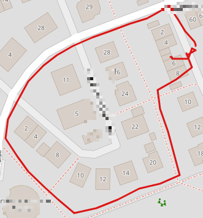

# rak8212-espruino-gps-tracker
Example how to record track data using satellite navigation (GNSS).

GNSS = Global Navigation Satellite System

* Turns on the BG96 module on the RAK8212.
* Every 10 seconds questions the GNSS position and writes it to local storage.
* With clear line of sight, it might take up to 5 minutes to receive positions (cold start).
* The blue LED will blink while no position is available.
* The stored track data can be interactively exported by calling the JavaScript function
  `formatTrackToPlainText();`
* Data in this CSV format can be imported into the online visualization tool 
  GPS Visualizer (http://www.gpsvisualizer.com/)   

**NOTE:** This example will only work if you are connected to the RAK8212 via Bluetooth LE. 
  Serial connection via USB **does not work**. 

## Plaintext CVS Format
The JavaScript function `formatTrackToPlainText();` can be called interactively
to output the track data in plain text in CSV format. The tracking is stopped 
after this method is called. The data can be copied from the console and pasted
into a text editor of your choice.

    trackpoint,time,latitude,longitude,alt
    1 , 20:25:41 , 48.95682144165 , 9.43764019012 , 331
    2 , 20:25:43 , 48.95682907104 , 9.43764019012 , 330
    3 , 20:25:53 , 48.95684814453 , 9.43762969970 , 329
    4 , 20:26:03 , 48.95690917968 , 9.43754959106 , 324
    5 , 20:26:13 , 48.95697021484 , 9.43749046325 , 318
    6 , 20:26:23 , 48.95705032348 , 9.43741035461 , 319
    7 , 20:26:33 , 48.95698165893 , 9.43721961975 , 318
    8 , 20:26:43 , 48.95695114135 , 9.43706035614 , 314
    9 , 20:26:53 , 48.95690917968 , 9.43688964843 , 313
    10 , 20:27:03 , 48.95687103271 , 9.43673992156 , 313
    11 , 20:27:13 , 48.95682144165 , 9.43657016754 , 313
    ...
    41 , 20:32:13 , 48.95676040649 , 9.43741989135 , 314
    42 , 20:32:16 , 48.95676040649 , 9.43741989135 , 314

## Possible Visualization
This shows an example visualization of a recorded track on a map
using GPS Visualizer.
  
  
